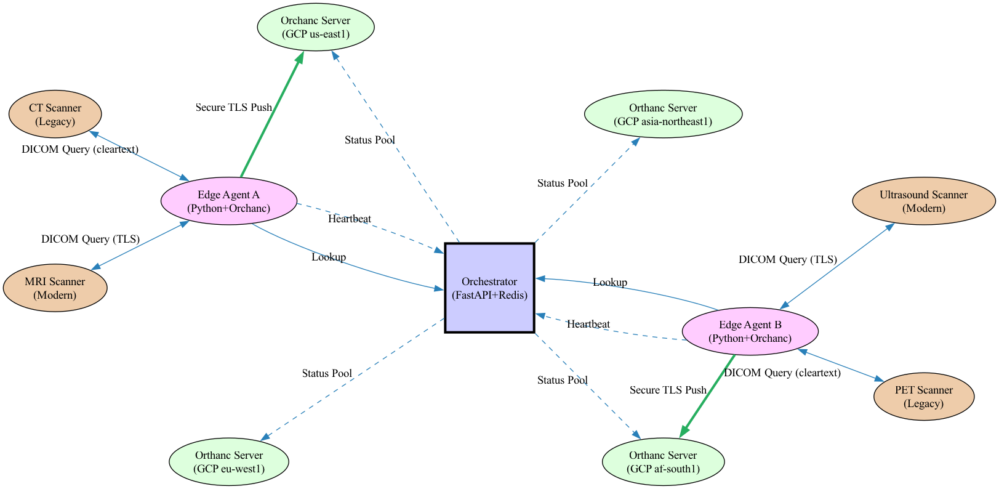

# Diomede — Dynamic DICOM Endpoint Routing

A [GSoC 2026](https://summerofcode.withgoogle.com/) project built with the
[KathiraveluLab @ University of Alaska Anchorage](https://github.com/KathiraveluLab)
that replaces static DICOM endpoint configuration with an intelligent,
self-healing routing mesh across regional cloud PACS nodes.

Every DICOM connection today is identified by a fixed `{IP, port, AE Title}`
triple compiled into scanner firmware. When the destination node is overloaded,
its network link degrades, or its disk fills, there is no mechanism to redirect
traffic. Studies queue, radiologists wait, and in time-critical scenarios
delays have clinical consequences. Meanwhile, nodes in other regions sit idle.
Diomede solves this by continuously monitoring queue depth, disk space, and
round-trip latency across every registered Orthanc node and routing each
incoming study to the optimal destination in milliseconds.



An edge site sends DICOM studies to a local **Forwarder Daemon**, which queries
the **Orchestrator** for the lowest-cost cloud node and posts the bytes there
directly. The Orchestrator scores all nodes registered in Redis and
automatically excludes any node whose heartbeat TTL has expired.

[Full architecture](docs/architecture.md)

---

## Quick start

Requires Docker Compose v2 and Python 3.12+.

```bash
cp .env.example .env      # set ORTHANC_PASSWORD and ORCHESTRATOR_API_KEY

docker compose up -d orthanc-us orthanc-eu orthanc-asia orthanc-af
docker compose up -d --build orchestrator edge-agent

# Verify all 6 containers are healthy
docker compose ps

# Ask the Orchestrator for the best node
curl -s http://localhost:8000/get-best-node \
  -H "X-API-Key: <your_api_key>" | python3 -m json.tool
```

[Full setup guide](docs/setup.md) — latency injection, failover testing,
load testing, Orthanc web UIs, troubleshooting

---

## Development

```bash
python3 -m venv .venv && source .venv/bin/activate
pip install -e ".[orchestrator,test,dev]"

# Unit tests (no Docker required)
python -m pytest tests/unit/ -v -m unit --cov=src --cov-fail-under=80

# Linting and type checks
ruff check src/
for src_dir in src/orchestrator src/edge src/simulator; do
  (cd "$src_dir" && mypy .)
done

```

[Contributing](CONTRIBUTING.md) — pre-commit hooks, integration tests,
scoring weight tuning

---

## Documentation

| Document | Description |
|---|---|
| [Architecture](docs/architecture.md) | System design, routing lifecycle, scoring algorithm, dead-node detection |
| [Setup guide](docs/setup.md) | Full Docker environment, WAN latency simulation, failover and load testing |
| [Contributing](CONTRIBUTING.md) | Development workflow, pre-commit hooks, test strategy |

---

## License

[MIT](LICENSE)
