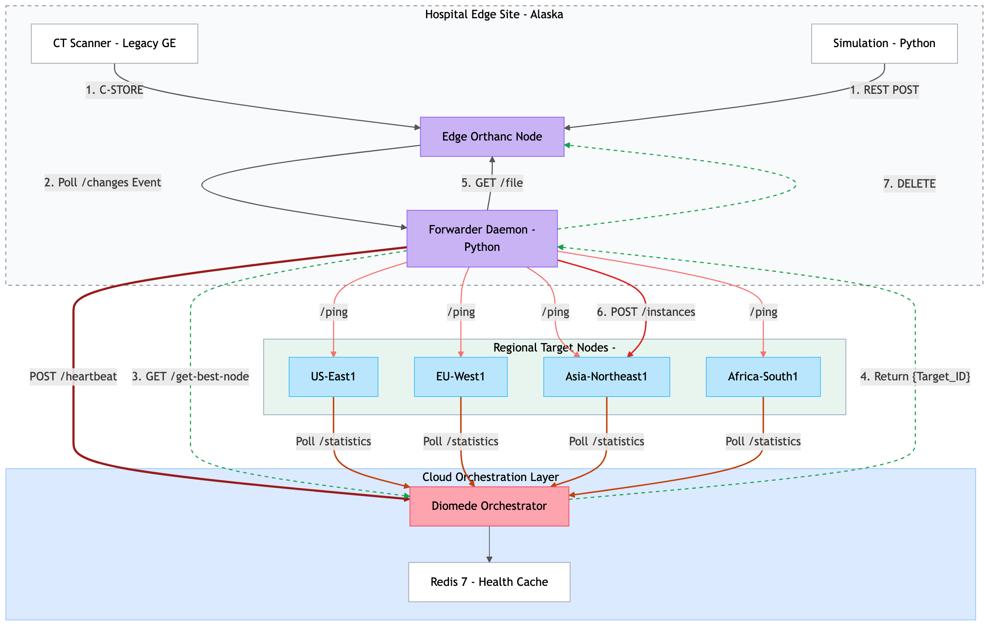
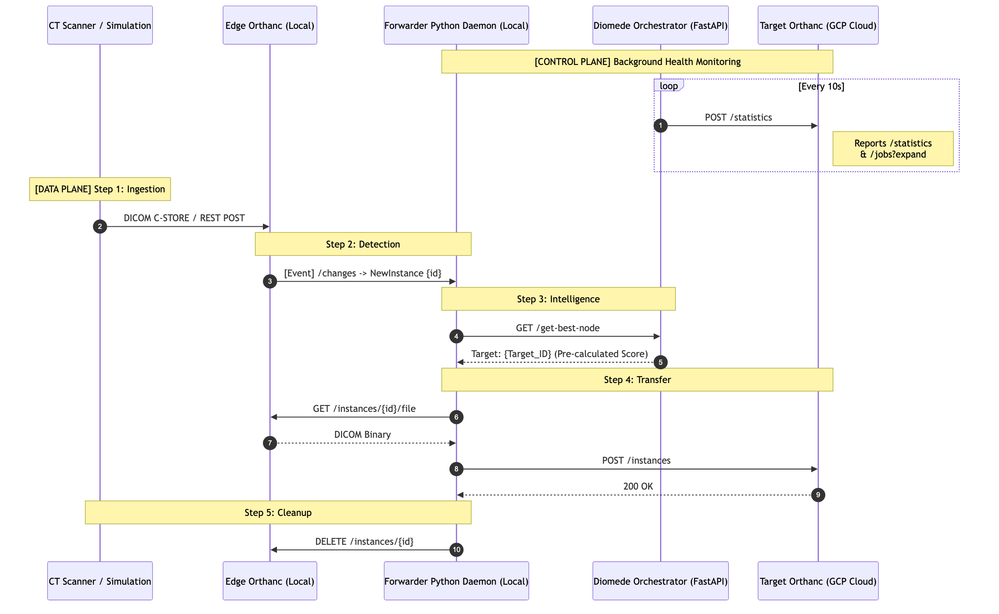

# Architecture

## 1. Background

Teleradiology depends on reliable, low-latency transfer of large DICOM images
between remote clinics and reading centers. Every DICOM connection is identified
by a static triple `{IP address, port, AE Title}`, which is compiled into scanner
firmware or PACS worklist databases that require manual IT intervention to
change. This works until a destination node is overloaded with prior studies,
its network link degrades, or its disk fills. Nodes in other regions sit idle
while the configured node is saturated, and operators have no real-time
mechanism to redirect traffic.

Beyond clinical teleradiology, federated learning workflows face the same
bottleneck: a coordinator dispatching model-update jobs must rely on static,
potentially stale manifests and cannot adapt when data is replicated or
migrated. Dynamic endpoint resolution is therefore a prerequisite for truly
distributed radiomics pipelines.

Diomede addresses both cases with a real-time orchestration layer - the
Orchestrator scores every registered node continuously and routes each transfer
to the optimal destination automatically, with no scanner reconfiguration.

## 2. System Overview

Diomede connects hospital edge sites to a pool of regional cloud PACS nodes.
An edge site receives DICOM studies from local scanners, queries the central
Orchestrator for the best available node, and forwards each study directly to
the winner without any manual configuration at the edge.



The four cloud nodes form a **star topology** — the Orchestrator is the hub
that registers and scores each regional Orthanc spoke. The Forwarder queries
the hub for a routing decision, then posts DICOM bytes directly to the winning
spoke.


## 3. Routing Event of a 7-Step Lifecycle



1. Scanner sends DICOM C-STORE → Edge Orthanc (production path), or simulation
   script POSTs raw DICOM bytes to `POST /instances` on the Edge Orthanc REST
   API (test path, which is identical from the Forwarder's perspective)
2. Forwarder polls `GET /changes` every 5 s and detects `NewInstance`
3. Forwarder queries `GET /orchestrator:8000/get-best-node`
4. Orchestrator scores all healthy Redis entries, returns winner
5. Forwarder downloads `GET /instances/{id}/file` from Edge Orthanc
6. Forwarder posts raw DICOM bytes to `POST /target-node:8042/instances`
7. Forwarder deletes instance from Edge Orthanc (`DELETE /instances/{id}`)

## 4. Scoring Algorithm

The scoring logic (to be implemented in `src/orchestrator/scorer.py`),
so it can be unit-tested in isolation
and swapped for alternative implementations (latency-only, ML-based, etc.)
without touching any endpoint code.

```
score = W_queue × (1 / (queue_size + 1))
      + W_disk  × (disk_free_mb / disk_total_mb)
      + W_rtt   × (1 / (rtt_ms + 1))
```

Default weights: `W_queue=0.5`, `W_disk=0.15`, `W_rtt=0.35`, which are configurable via env vars.

## 5. Dead-Node Detection

The Telemetry Daemon writes each node's health to Redis with a **30-second TTL**. If a node becomes unreachable, the daemon writes `{"healthy": false}` — and if the daemon itself can't reach Redis, the TTL expires and the key disappears. Both cases cause the Orchestrator to exclude the node from the next routing decision automatically.
