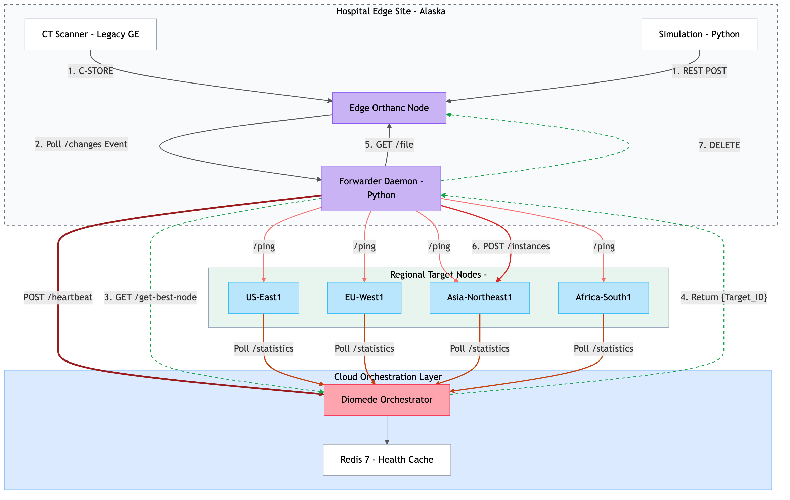
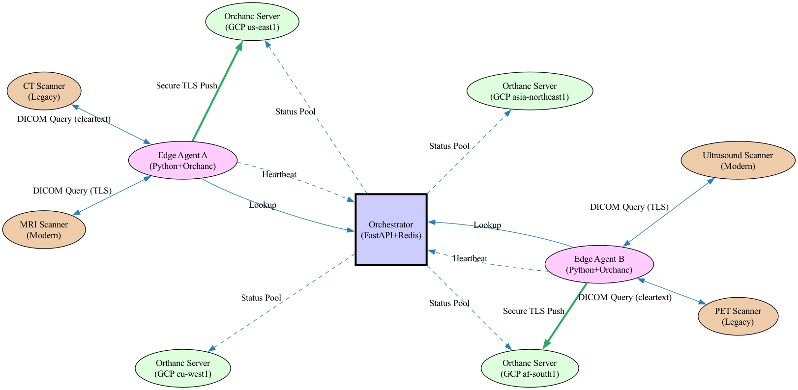
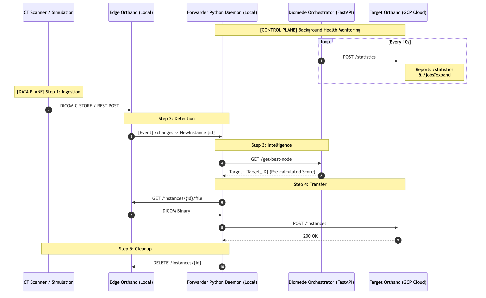

# Architecture

## 1. Background

Teleradiology depends on reliable, low-latency transfer of large DICOM images
between remote clinics and reading centers. Every DICOM connection is identified
by a static triple `{IP address, port, AE Title}`, which is compiled into scanner
firmware or PACS worklist databases that require manual IT intervention to
change. This works until a destination node is overloaded with prior studies,
its network link degrades, or its disk fills. Nodes in other regions sit idle
while the configured node is saturated, and operators have no real-time
mechanism to redirect traffic.

Beyond clinical teleradiology, federated learning workflows face the same
bottleneck: a coordinator dispatching model-update jobs must rely on static,
potentially stale manifests and cannot adapt when data is replicated or
migrated. Dynamic endpoint resolution is therefore a prerequisite for truly
distributed radiomics pipelines.

Diomede addresses both cases with a real-time orchestration layer - the
Orchestrator scores every registered node continuously and routes each transfer
to the optimal destination automatically, with no scanner reconfiguration.

## 2. System Overview

Diomede connects hospital edge sites to a pool of regional cloud PACS nodes.
An edge site receives DICOM studies from local scanners, queries the central
Orchestrator for the best available node, and forwards each study directly to
the winner without any manual configuration at the edge.

## 2.1 Architecture Diagram


The four cloud nodes form a **star topology** — the Orchestrator is the hub
that registers and scores each regional Orthanc spoke. The Forwarder queries
the hub for a routing decision, then posts DICOM bytes directly to the winning
spoke.

## 2.2 Star Diagram


## 3. Routing Event of a 7-Step Lifecycle

## 3.1 Sequence Diagram


1. Scanner sends DICOM C-STORE → Edge Orthanc (production path), or simulation
   script POSTs raw DICOM bytes to `POST /instances` on the Edge Orthanc REST
   API (test path, which is identical from the Forwarder's perspective)
2. Forwarder polls Edge Orthanc every 5 s (`GET /studies`, then
   `GET /studies/{id}/instances`) and groups buffered instances by study
3. Forwarder queries `GET /orchestrator:8000/get-best-node?agent_id=...&study_id=...`
   once per study
4. Orchestrator returns the node the study is pinned to, or scores all healthy
   Redis entries and pins the winner (see 3.2)
5. For each instance of the study, Forwarder streams `GET /instances/{id}/file`
   from Edge Orthanc
6. ... and posts the raw DICOM bytes to `POST /target-node:8042/instances`
7. Forwarder deletes each forwarded instance from Edge Orthanc (`DELETE /instances/{id}`)

## 3.2 Study Affinity

A CT or MR study can hold hundreds of instances, and node scores change while it
is being forwarded (telemetry refreshes, disk fills, new RTT values). Routing each
instance on its own could split one study across several regions, so a radiologist
would see an incomplete series. Diomede therefore routes per study:

- The Forwarder sends the Orthanc study ID with each routing request. This ID is an
  opaque hash, not the StudyInstanceUID, so no PHI reaches the Orchestrator or logs.
- The first request for a study scores the healthy nodes and stores the winner with
  `SET study:{study_id} <node_id> NX EX STUDY_AFFINITY_TTL_S`. `NX` makes the first
  writer win, so two edge agents racing on one study get the same node.
- Later requests return the pinned node while it is healthy, even if another node
  now scores higher, and refresh the TTL. Expired keys clean themselves up.
- If the pinned node is unhealthy or its telemetry key has expired, the study is
  re-pinned to the current best node, a warning is logged, and the response carries
  `"rerouted": true` so the split is visible to operators.
- If a forward fails part way through a study, the remaining instances stay in the
  edge buffer. The next poll asks again and gets the same node (or the re-pinned one),
  so nothing is lost and nothing is uploaded twice.

Requests without `study_id` keep the old per-instance behaviour, so the Orchestrator
and the edge agents can be upgraded independently.

## 4. Scoring Algorithm

The scoring logic is implemented in `src/orchestrator/weighted_scorer.py`, so it can be unit-tested in isolation and swapped
for alternative implementations (round-robin, latency-only, ML-based, etc.) without touching any endpoint code. The scorer is selected at startup by the `SCORER` environment variable (default `weighted`) via the registry in `scorer.py`.

```
score = W_queue × (1 / (queue_size + 1))
      + W_disk  × (disk_free_mb / disk_total_mb)
      + W_rtt   × (1 / (rtt_ms / rtt_ref_ms + 1))
```

Each term is an inverse-cost signal normalized to `(0, 1]`: a shorter queue, more
free disk, and lower RTT all raise the score, and the highest-scoring node wins.
Default weights `W_queue=0.5`, `W_disk=0.15`, `W_rtt=0.35` (configurable via
environment variables) and reference `rtt_ref_ms=100`. If a node has never reported
an RTT, the scorer falls back to a neutral default so decisions degrade gracefully
to queue depth and disk space rather than failing.

## 5. Dead-Node Detection

The Telemetry Daemon writes each node's health to Redis with a **30-second TTL**. If a node becomes unreachable, the daemon writes `{"healthy": false}` — and if the daemon itself can't reach Redis, the TTL expires and the key disappears. Both cases cause the Orchestrator to exclude the node from the next routing decision automatically.

## 6. Non-Functional Requirements

### 6.1 Orchestrator Resilience

Every routing decision requires a synchronous call to `GET /get-best-node`, which makes the Orchestrator a potential single point of failure (SPOF). Two mitigations are currently in place:

**Automatic container restart.** The orchestrator container runs with `restart: unless-stopped`, so Docker restarts it automatically on process crashes. Node health data repopulates within one Telemetry Daemon poll cycle (10 s), bounding the recovery window to roughly 10–30 s in practice.

**Last-known-node fallback.** The Forwarder caches the last successful routing response in memory (`_last_best_node` in `forwarder.py`). If the Orchestrator is temporarily unreachable, the Forwarder reuses the previous best node rather than dropping the instance. Forwarding continues at reduced optimality since routing decisions are stale but still valid till the Orchestrator recovers and the next successful response refreshes the cache.

**Planned enhancements:**

- *Redis persistence and standalone deployment.* Redis currently runs inside the orchestrator container, so a restart clears all state including the RTT measurements that are gathered only once per hour. Currently routing degrades gracefully because the scorer defaults to 250 ms RTT for all nodes, neutralising the RTT term so decisions fall back to queue depth and disk space rather than failing entirely. One enhancement is to move Redis to a standalone service with AOF (Append-Only File) persistence, which would preserve RTT history across restarts, fully restoring routing quality immediately rather than waiting for the next hourly probe cycle.

- *Horizontal scaling.* With Redis externalised, the Orchestrator becomes fully stateless and can run as multiple replicas behind a load balancer, eliminating any single process as a SPOF.

### 6.2 Security

Diomede handles medical imaging data, so all communication channels are authenticated and encrypted.

**TLS on every connection.** Every REST and DICOM link in the system runs over TLS: between the edge agent and Orchestrator, between the edge agent and regional nodes, between the Orchestrator daemon and regional nodes, and between the scanner and edge agent. All Orthanc nodes have `SslEnabled: true` (HTTPS on port 8042) and `DicomTlsEnabled: true` (DICOM TLS on port 4242). Certificates are issued from a shared self-signed CA (`scripts/gen_certs.sh`) and verified by every client via `REQUESTS_CA_BUNDLE`, so no traffic is sent in clear text in transit.

**Non-default Orthanc credentials.** Every Orthanc node has `AuthenticationEnabled: true`. Credentials are never hardcoded - they are injected at container startup from environment variables and substituted into the Orthanc config via `sed`. Both the Telemetry Daemon and the Forwarder log a warning at startup if the default `orthanc` password is still in use, making accidental deployment of insecure credentials visible immediately.

**Mutual TLS and AE title validation on the DICOM channel.** Regional nodes set `DicomTlsRemoteCertificateRequired: true`, which means any party initiating a DICOM association must present a certificate signed by the shared CA so a self-signed or unknown certificate is rejected right away. In addition regional nodes enforce `DicomCheckCalledAet: true` and `DicomCheckCallingAet: true`, so both the destination AE title and the caller's AE title must match a pre-registered entry in `DicomModalities`. Together, these two controls ensure that only the known edge agent with the correct AE title and a valid certificate can push and query DICOM data on a regional node.

**REST API key authentication on the Orchestrator.** All Orchestrator endpoints (`/get-best-node`, `/nodes`, `/heartbeat`) require a valid `X-API-Key` header. The key is set via the `ORCHESTRATOR_API_KEY` environment variable, which is a required field so the service fails fast at startup if it is not set. This prevents unauthorized clients from querying routing state or injecting fake RTT measurements.
